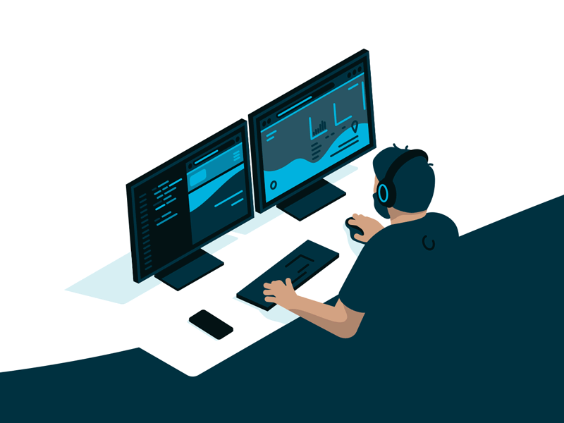

<p align="center">
  
</p>

<h1 align="center">Hi, I'm tech-zjf</h1>

<p align="center">
  <b>Full-stack Developer</b>
  <br />
  关注前端体验、后端接口、工程化交付和 AI 应用落地。
</p>

<table>
  <tr>
    <td width="58%" valign="top">
      <h2>About Me</h2>
      <p>
        我是一名全栈开发者，主要使用 TypeScript 技术栈构建 Web 应用、后台系统、组件能力和自动化工具。
        我更关注把需求拆清楚、把交互做顺、把接口和数据链路设计稳定，再用工程化方式持续交付。
      </p>
      <p>
        I enjoy building practical products with clean UI, typed APIs, maintainable architecture, and smooth developer experience.
      </p>
    </td>
    <td width="42%" valign="top">
      
    </td>
  </tr>
</table>

## What I Can Do

| Area | Skills |
| --- | --- |
| Frontend | React, Next.js, Vue, component design, responsive UI, state management, data fetching |
| Backend | Node.js, API design, authentication flow, data modeling, service integration |
| Full-stack | Product prototyping, admin systems, dashboard interfaces, frontend-backend collaboration |
| Engineering | TypeScript, monorepo workflow, package management, build tooling, linting, maintainable code structure |
| AI Apps | LLM API integration, prompt workflow design, information extraction, automation, AI-assisted product features |
| Desktop & Tools | Electron, browser-side interaction, keyboard shortcuts, small productivity tools |

## Tech Stack

<p>
  
</p>

<p>
  
  
  
  
  
</p>

## Working Style

```text
Understand first      Clarify the real product problem before writing code
Type everything       Prefer predictable contracts and maintainable interfaces
Ship pragmatically    Keep implementation focused, usable, and easy to evolve
Think full-stack      UI, API, data, auth, deployment, and operations all matter
Automate repeats      Turn repeated work into tools, templates, or workflows
```

## Current Focus

- Building cleaner full-stack web applications with TypeScript.
- Improving admin/dashboard product experience and reusable UI patterns.
- Exploring AI-assisted workflows for content processing, search, analysis, and automation.
- Keeping codebases small, typed, understandable, and easy to maintain.

<p align="center">
  <b>Code with context. Build for real use.</b>
</p>
